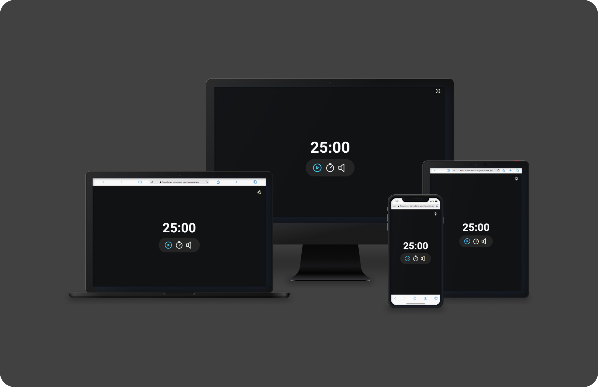

<h1 align="center"> Aplicação estilo pomodoro - Focus Timer</h1>

Desafio realizado no Stage 5 do programa Explorer da Rocketseat. 
Neste projeto aprendemos a aplicar conceitos de HTML, CSS, Javascript, acessibilidade, manipular a DOM, ES6 Modules (Import & Export), a utilização do Figma, animações com CSS e como tornar o projeto responsivo. 

A imagem abaixo representa o resultado final do projeto, e na seção Projeto Finalizado você pode acessar o projeto publicado online e conferir todos os detalhes. 
  

  <a href="#-tecnologias">Tecnologias</a>&nbsp;&nbsp;&nbsp;|&nbsp;&nbsp;&nbsp;
  <a href="#-projeto-finalizado">Projeto Finalizado</a>&nbsp;&nbsp;&nbsp;|&nbsp;&nbsp;&nbsp;
  <a href="#-layout">Layout</a>&nbsp;&nbsp;&nbsp;|&nbsp;&nbsp;&nbsp;
  <a href="#-agradecimentos">Agradecimentos</a>

 

## 🚀 Tecnologias

Esse projeto foi desenvolvido com as seguintes tecnologias:

- HTML
- CSS
- Javascript
- Git e Github
- Figma

## 💻 Projeto Finalizado

<a href="https://focustimer-pomodoro-gamma.vercel.app/" target="_blank"><strong> - Clique aqui para acessar o meu projeto finalizado.</strong></a>

## 🔖 Layout

Você pode visualizar o layout original do projeto através <a href="https://www.figma.com/file/nuav6mRWbB22dYpPtkqkga/Focus-Timer-V2-%E2%80%A2-Projeto-Explorer-(Community)?node-id=1422%3A28&mode=dev" target="_blank">DESSE LINK</a> . É necessário ter conta no <a href="https://figma.com" target="_blank">Figma</a> para acessá-lo.

## 💜 Agradecimentos

Um agradecimento especial a <b>Rocketseat</b> por todos os projetos educacionais e por estimular o aprendizado em comunidade. 🚀
<a href="https://discord.gg/rocketseat" target="_blank">Participe da nossa comunidade!</a>